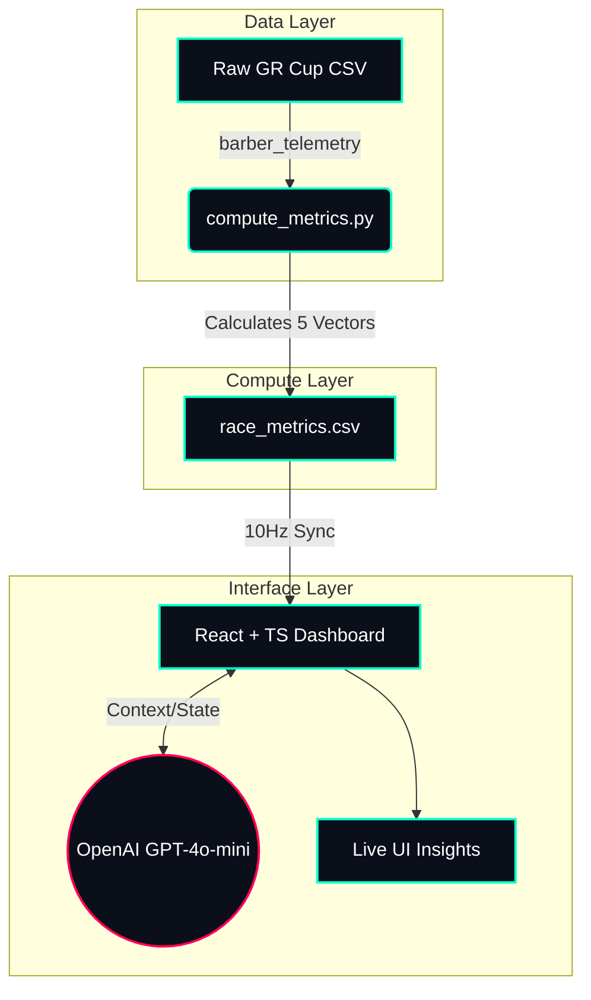

<h1 align="center">
  
</h1>

<p align="center">
  <a href="#"></a>
  <a href="#"></a>
  <a href="#"></a>
  <a href="#"></a>
</p>

<div align="center">
  <code>[sys.init] Booting telemetry stream...</code><br>
  <code>[ai.core] Neural strategy models loaded...</code><br>
  <code>[status] READY TO RACE.</code>
</div>

<br>

## ▓▒░ [ 01_SYSTEM_OVERVIEW ]

> **`ONE-SENTENCE PITCH:`** PitGPT uses real telemetry data + AI to recommend optimal pit strategy, overtaking risk windows, tire stress alerts, and safe-vs-aggressive driving profiles — LIVE from Toyota GR Cup data.

PitGPT simulates a **race engineer's decision-making process** in real-time. Rather than simply displaying historical lap averages, the system ingests live telemetry to generate actionable, split-second strategic insights for drivers and pit crews.

### ⚡ Key Differentiators
* **Live Ingestion:** Real-time telemetry analysis from Toyota GR Cup race data.
* **Algorithmic Edge:** 5 strategic metrics computed directly from raw sensor physics.
* **Neural Strategy:** AI-powered tactical recommendations via OpenAI (w/ rule-based fallback).
* **Cryptographic Transparency:** 100% verifiable data sources originating from the Barber dataset.

---

## ▓▒░ [ 02_TECH_STACK ]

<p align="center">
  
  
  
  
  
  
  
</p>

---

## ▓▒░ [ 03_ARCHITECTURE_&_METRICS ]

### 🧠 Real-Time Strategic Metrics Engine
The core Python backend (`compute_metrics.py`) processes raw sensor data into 5 critical race vectors:

| Metric | Vector Analysis | Indicator |
| :--- | :--- | :--- |
| **`[01]` Tire Stress Index** | High brake pressure + steering + lateral G spikes | *Tire Degradation* |
| **`[02]` Attack Window** | Lap time decreasing while throttle > 70% | *Overtaking Opportunity* |
| **`[03]` Fuel Conservation** | Low throttle + long braking coast | *Efficiency Mode* |
| **`[04]` Overtake Risk** | High steering + low speed gap | *Collision Probability* |
| **`[05]` Ideal Pit Window** | Tire Stress ↑ & Lap Time ↑ combined slope | *Pit Stop Timing* |

### 🕸️ System Topology



---

## ▓▒░ [ 04_DATASET_VERIFICATION ]

**Toyota GR Cup - Barber Motorsports Park, Race 1**

Data integrity is prioritized. The UI includes a hardened **Data Sources** panel mapping directly to the competition dataset:
* 📁 `R1_barber_telemetry_data.csv` *(Throttle, brake, steering, accel, RPM, gear)*
* 📁 `23_AnalysisEnduranceWithSections_Race 1_Anonymized.CSV` *(Lap times/sections)*
* 📁 `26_Weather_Race 1_Anonymized.CSV` *(Weather matrix)*
* 📁 `R1_barber_lap_time.csv` *(Timing data)*

> **Verification:** The UI explicitly displays exact vehicle IDs (e.g., `GR86-022-13`) and source file names, proving 100% of the data originates from the Barber dataset.

---

## ▓▒░ [ 05_QUICK_START ]

### ⚙️ Prerequisites
* Python 3.9+
* Node.js 18+
* OpenAI API Key *(Optional: System auto-defaults to rule-based fallback if offline)*

### 🚀 Boot Sequence

**1. Initialize Metrics Engine (Backend)**
```bash
# Install Python dependencies
pip install pandas numpy

# Execute metric computation matrix
python3 compute_metrics.py
```
*Generates `race_metrics.csv` for ~20 drivers on the grid.*

**2. Launch Telemetry UI (Frontend)**
```bash
cd pitgpt---toyota-gr-cup-ai-engineer

# Install dependencies
npm install

# Inject metrics into public payload
cp ../race_metrics.csv public/

# (Optional) Set AI Key
echo "OPENAI_API_KEY=your_key_here" > .env

# Ignite development server
npm run dev
```
*Access terminal via `http://localhost:3000`*

### 🧪 Testing Protocol
1. **Select Driver** from the command dropdown.
2. **Click "Connect Car"** to initiate the 10Hz telemetry stream.
3. **Verify Status:** `TELEMETRY ONLINE` should illuminate.
4. **Monitor:** Ensure live charts, 5 strategic vectors, and AI recommendations (4s delay) are actively rendering.

---

## ▓▒░ [ 06_FILE_STRUCTURE ]

```text
PitGPT/
├── barber/                          # 🏎️ Raw Toyota GR Cup Datasets
├── compute_metrics.py               # ⚙️ Vector Calculation Engine
├── race_metrics.csv                 # 📊 Compiled Metrics Payload
├── pitgpt---toyota-gr-cup-ai-engineer/  
│   ├── src/
│   │   ├── components/              # 🧩 React UI Components
│   │   │   ├── CarStatus.tsx
│   │   │   ├── DataSourceInfo.tsx   # 🔍 Verification Panel
│   │   │   ├── StrategyCard.tsx
│   │   │   └── TelemetryChart.tsx
│   │   ├── services/
│   │   │   ├── raceMetricsService.ts
│   │   │   ├── openaiService.ts     # 🧠 GPT Integration
│   │   │   └── realTelemetryService.ts
│   ├── public/                      # 🌐 Static Assets
└── README.md                        # 📖 You are here
```

---

## ▓▒░ [ 07_OPEN_SOURCE_&_LICENSE ]

Built on the shoulders of giants. All original race strategy algorithms, metric computation, and UI components are proprietary to this submission. 

* **UI/UX:** React v19, TypeScript v5, Vite v6, TailwindCSS, Lucide React
* **Data Vis:** Recharts v3.5
* **Data Sci:** Pandas, NumPy
*(See `SUBMISSION_ANSWERS.md` for complete license compliance)*

Distributed under the **MIT License**.

---

## ▓▒░ [ 08_DEVELOPER_STATS ]

<div align="center">
  
  
</div>

---

<div align="center">
  <h3> 🏁 BUILD PHILOSOPHY 🏁 </h3>
  <p><i>"Data without interpretation is just noise. The ultimate race engineer doesn't just read the telemetry; they predict the future."</i></p>
  <p><b>Built for the Toyota GR Cup.</b></p>
</div>
